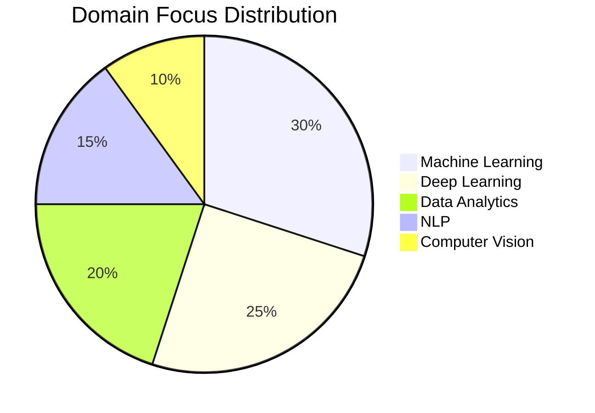

<div align="center">

<!-- ▓▓ GLITCH NAME ▓▓ -->


<!-- ▓▓ TYPING SUBTITLE ▓▓ -->
<a href="https://git.io/typing-svg">
  
</a>

<br/>

<!-- ▓▓ NEON DIVIDER ▓▓ -->


<!-- ▓▓ TECH BADGES ▓▓ -->
<br/>


<br/>


</div>

-----

<div align="center">

### •   A B O U T   M E   •

I am Pocharam Gayathri an aspiring **Full Stack Developer** and **AI Engineer** pursuing my B.Tech in CSE (Data Science) at **Woxsen University**. My focus lies at the intersection of robust web architectures and intelligent systems—specializing in **Full Stack Web Architectures**, **AI-Powered Integrations**, and **Scalable Platforms**. I strive to bridge complex technologies with intuitive user experiences that empower communities and drive impact.

</div>

-----

## ✦ Core Identity

<div align="center">
<div style="
  backdrop-filter: blur(12px);
  background: rgba(255,255,255,0.05);
  border-radius: 16px;
  padding: 20px;
  width: 80%;
  border: 1px solid rgba(255,255,255,0.1);
">

<table>
  <tr>
    <td align="center" width="150"><strong>Name</strong></td>
    <td align="center">Gayathri Pocharam</td>
  </tr>
  <tr>
    <td align="center"><strong>Education</strong></td>
    <td align="center">B.Tech CSE (Data Science) @ Woxsen University, Hyderabad</td>
  </tr>
  <tr>
    <td align="center"><strong>Focus</strong></td>
    <td align="center">Full Stack Web • AI Integrations • Scalable Systems</td>
  </tr>
  <tr>
    <td align="center"><strong>Mindset</strong></td>
    <td align="center"><i>User Centric • Clean Code • Scalable Systems</i></td>
  </tr>
</table>

</div>
</div>

-----

<!-- ═══════════════════════════════════════════════════════════ -->

<!--                 •  PATENT ACHIEVEMENT  •                  -->

<!-- ═══════════════════════════════════════════════════════════ -->

<div align="center">

### •   P A T E N T   A C H I E V E M E N T   •


**Title:** *IoT Connectivity Device Design*  
**Design No:** `470097-001`  
**Role:** Co-Inventor  
**Authority:** Intellectual Property India, Government of India  

</div>


-----

## ✦ What I Build

### ⚙️ Tech Stack & Domains

<div align="center">
<div style="
  backdrop-filter: blur(12px);
  background: rgba(255,255,255,0.05);
  border-radius: 16px;
  padding: 20px;
  width: 80%;
  border: 1px solid rgba(255,255,255,0.1);
">

<table>
  <tr>
    <td align="center" width="180"><strong>🌐 Web Dev</strong></td>
    <td align="center">React • Node.js • Express • Flask • HTML5 • CSS3 • TailwindCSS</td>
  </tr>
  <tr>
    <td align="center"><strong>🐍 Languages</strong></td>
    <td align="center">Python • JavaScript • SQL • C++ • R</td>
  </tr>
  <tr>
    <td align="center"><strong>🤖 AI & ML</strong></td>
    <td align="center">PyTorch • TensorFlow • Scikit-learn • NLP</td>
  </tr>
  <tr>
    <td align="center"><strong>🗄️ Databases</strong></td>
    <td align="center">SQLite • PostgreSQL</td>
  </tr>
  <tr>
    <td align="center"><strong>🐳 Tools & Ops</strong></td>
    <td align="center">Git • GitHub • Docker • Linux • CI/CD</td>
  </tr>
</table>

</div>
</div>

-----

<!-- ═══════════════════════════════════════════════════════════ -->


<!-- ═══════════════════════════════════════════════════════════ -->


-----

<!-- ═══════════════════════════════════════════════════════════ -->

<!--          •  FEATURED PROJECT DEEP DIVES  •                -->

<!-- ═══════════════════════════════════════════════════════════ -->

<div align="center">

### •   F E A T U R E D   P R O J E C T S   —   D E E P   D I V E   •

</div>

<table>
<tr>
<td width="50%" valign="top">

**🧠 StrokeGuard AI — Health Prediction**
*ML-Powered Early Warning System*

```
┌─────────────────────────────────┐
│         DATA PIPELINE           │
│                                 │
│  [ CLINICAL DATA INPUT ]        │
│        ↓                        │
│  [ Pre-processing Lab ]         │
│    Handling Missing Values      │
│        ↓                        │
│  [ Feature Engineering ]        │
│    Correlating Risk Factors     │
│        ↓                        │
│  [ ML Training Engine ]         │
│    Random Forest / XGBoost      │
│        ↓                        │
│  [ Prediction Web App ]         │
│    Flask / Streamlit Interface  │
└─────────────────────────────────┘
```

**Stack:** `Python` `Scikit-learn` `XGBoost` `Flask` `Pandas`
**Status:** <font color="#00C86F">LIVE</font>

</td>
<td width="50%" valign="top">

**🌉 FoodBridge — Surplus Food Redistribution**
*Full-Stack Sharing Platform*

```
┌─────────────────────────────────┐
│         PLATFORM FLOW           │
│                                 │
│  [ SURPLUS DONORS ]             │
│        ↓                        │
│  [ Quality Verification ]       │
│    Safe Temp & Expiry Scan      │
│        ↓                        │
│  [ FoodBridge Core ]            │
│    Matching & Routing Engine    │
│        ↓                        │
│  [ VOLUNTEERS / NGOS ]          │
│    Claiming Delivery Tasks      │
│        ↓                        │
│  [ IMPACT METRICS ]             │
│    CO₂ Savings & Meals Saved    │
└─────────────────────────────────┘
```

**Stack:** `React` `Flask` `SQLite` `TailwindCSS` `Node.js`
**Status:** <font color="#00C86F">ACTIVE</font>

</td>
</tr>
<tr>
<td colspan="2" align="center" valign="top">

<div align="left" style="width: 350px; text-align: left; display: inline-block;">

**📊 E-commerce BI Dashboard**
*Interactive Business Intelligence Matrix*

```
┌─────────────────────────────────┐
│        ANALYTICS FLOW           │
│                                 │
│  [ RAW SQL DATABASE ]           │
│        ↓                        │
│  [ ETL Processing ]             │
│    Cleaning & Normalizing       │
│        ↓                        │
│  [ PowerBI Core Map ]           │
│    DAX Queries + Visuals        │
│        ↓                        │
│  [ Insight Delivery ]           │
│    Sales + Growth Trends        │
│        ↓                        │
│  [ Periodic Reporting ]         │
│    Automated PDF generation     │
└─────────────────────────────────┘
```

**Stack:** `PowerBI` `SQL` `Python` `Pandas` `Excel`
**Status:** <font color="#00C86F">ACTIVE</font>

</div>

</td>
</tr>
</table>

-----

<!-- ═══════════════════════════════════════════════════════════ -->


<!-- ═══════════════════════════════════════════════════════════ -->


<!-- ═══════════════════════════════════════════════════════════ -->


<!-- ═══════════════════════════════════════════════════════════ -->

<!--                 •  GITHUB METRICS  •                      -->

<!-- ═══════════════════════════════════════════════════════════ -->

<div align="center">

### •   G I T H U B   M E T R I C S   •


&nbsp;&nbsp;


<br/><br/>


</div>

-----

<!-- ═══════════════════════════════════════════════════════════ -->

<!--                 •  ACTIVITY GRAPH  •                      -->

<!-- ═══════════════════════════════════════════════════════════ -->

<div align="center">

### •   C O M M I T   T I M E L I N E   •


</div>

-----

<!-- ═══════════════════════════════════════════════════════════ -->

<!--                  •  TROPHIES  •                           -->

<!-- ═══════════════════════════════════════════════════════════ -->

<div align="center">

### •   A C H I E V E M E N T   G R I D   •


<br/><br/>

<div style="
  backdrop-filter: blur(12px);
  background: rgba(255,255,255,0.05);
  border-radius: 16px;
  padding: 20px;
  width: 80%;
  border: 1px solid rgba(255,255,255,0.1);
">

<table>
  <thead>
    <tr>
      <td align="center" width="250"><strong>🏆 Award</strong></td>
      <td align="center" width="100"><strong>📅 Year</strong></td>
      <td align="center"><strong>🏛️ Institution</strong></td>
    </tr>
  </thead>
  <tbody>
    <tr>
      <td align="center">StrokeGuard AI Innovation Lead</td>
      <td align="center">2024</td>
      <td align="center">Woxsen School of Technology</td>
    </tr>
    <tr>
      <td align="center">Academic Excellence in Data Science</td>
      <td align="center">2024</td>
      <td align="center">Woxsen University</td>
    </tr>
    <tr>
      <td align="center">15+ Data Science Public Projects</td>
      <td align="center">2024–25</td>
      <td align="center">GitHub</td>
    </tr>
    <tr>
      <td align="center">AI Research & Workshop Facilitator</td>
      <td align="center">2024–25</td>
      <td align="center">Various · Peer-led</td>
    </tr>
  </tbody>
</table>

</div>

</div>

-----

<!-- ═══════════════════════════════════════════════════════════ -->

<!--              •  DOMAIN EXPERTISE PIE  •                   -->

<!-- ═══════════════════════════════════════════════════════════ -->

<div align="center">

### •   D O M A I N   F O C U S   D I S T R I B U T I O N   •

<div style="
  backdrop-filter: blur(12px);
  background: rgba(255,255,255,0.05);
  border-radius: 16px;
  padding: 20px;
  width: 80%;
  border: 1px solid rgba(255,255,255,0.1);
">



</div>

</div>

-----

<!-- ═══════════════════════════════════════════════════════════ -->

<!--                  •  AI PERSONALITY  •                     -->

<!-- ═══════════════════════════════════════════════════════════ -->

<div align="center">

### •   G A Y A T H R I . A I   —   P E R S O N A L I T Y   M O D U L E   •

<br/>

<div style="
  backdrop-filter: blur(12px);
  background: rgba(255,255,255,0.05);
  border-radius: 16px;
  padding: 20px;
  width: 80%;
  border: 1px solid rgba(255,255,255,0.1);
">

#### ⚙️ System Profile & Parameters

<table>
  <tr>
    <td align="center" width="180"><strong>Operating Since</strong></td>
    <td align="center"><code>2024</code></td>
  </tr>
  <tr>
    <td align="center"><strong>Version / Build</strong></td>
    <td align="center"><code>3.1-stable</code> | <code>2028-optimized</code></td>
  </tr>
  <tr>
    <td align="center"><strong>Current Location</strong></td>
    <td align="center">Hyderabad, India 🇮🇳</td>
  </tr>
  <tr>
    <td align="center"><strong>Current Station</strong></td>
    <td align="center">Woxsen University - CSE-DS '28</td>
  </tr>
  <tr>
    <td align="center"><strong>System Status</strong></td>
    <td align="center"><code>🟢 ONLINE — coding solutions</code></td>
  </tr>
</table>

</div>

<br/>

<div style="
  backdrop-filter: blur(12px);
  background: rgba(255,255,255,0.05);
  border-radius: 16px;
  padding: 20px;
  width: 80%;
  border: 1px solid rgba(255,255,255,0.1);
">

#### 🧠 Core Philosophies & Logic

<table>
  <tr>
    <td align="center" width="180"><strong>🔍 Analyze</strong></td>
    <td align="center"><em>"What do the users need and how can the systems scale?"</em></td>
  </tr>
  <tr>
    <td align="center"><strong>🛠️ Solve</strong></td>
    <td align="center"><em>"Clean code. Robust APIs. Seamless user experience."</em></td>
  </tr>
  <tr>
    <td align="center"><strong>📚 Learn</strong></td>
    <td align="center"><em>"Every technology stack is a tool to solve real-world problems."</em></td>
  </tr>
  <tr>
    <td align="center"><strong>🎯 Goal</strong></td>
    <td align="center"><em>"Build tech that bridges gaps & empowers communities. 🌍"</em></td>
  </tr>
</table>

</div>

<br/>

<div style="
  backdrop-filter: blur(12px);
  background: rgba(255,255,255,0.05);
  border-radius: 16px;
  padding: 20px;
  width: 80%;
  border: 1px solid rgba(255,255,255,0.1);
">

#### 🔌 Subsystem Diagnostics

<table>
  <tr>
    <td align="center" width="180"><strong>🌐 Web Engine</strong></td>
    <td align="center"><code>🟢 ONLINE</code> — React + Flask API active</td>
  </tr>
  <tr>
    <td align="center"><strong>🤖 AI Hub</strong></td>
    <td align="center"><code>🟢 ONLINE</code> — PyTorch + Transformers</td>
  </tr>
  <tr>
    <td align="center"><strong>📊 Viz Lab</strong></td>
    <td align="center"><code>🟢 ONLINE</code> — PowerBI + Plotly active</td>
  </tr>
  <tr>
    <td align="center"><strong>💾 DB Ops</strong></td>
    <td align="center"><code>🟢 ONLINE</code> — PostgreSQL + SQLite connected</td>
  </tr>
  <tr>
    <td align="center"><strong>📦 Deploy Ops</strong></td>
    <td align="center"><code>🟢 ONLINE</code> — Dockerized + CI/CD active</td>
  </tr>
</table>

</div>

<br/>

<div style="
  backdrop-filter: blur(12px);
  background: rgba(255,255,255,0.05);
  border-radius: 16px;
  padding: 20px;
  width: 80%;
  border: 1px solid rgba(255,255,255,0.1);
">

#### ⚡ Runtime Variables

<table>
  <tr>
    <td align="center" width="180"><strong>Role</strong></td>
    <td align="center">Full Stack Developer · AI Engineer</td>
  </tr>
  <tr>
    <td align="center"><strong>Specialty</strong></td>
    <td align="center">Full Stack Web & AI-Powered Applications</td>
  </tr>
  <tr>
    <td align="center"><strong>Mindset</strong></td>
    <td align="center">User Centric · Clean Code · Scalable Systems</td>
  </tr>
  <tr>
    <td align="center"><strong>Daily Fuel</strong></td>
    <td align="center"><code>Clean Code 💻</code> • <code>API Endpoints</code> • <code>React Hooks</code> • <code>Espresso ☕</code></td>
  </tr>
  <tr>
    <td align="center"><strong>Career Pathway</strong></td>
    <td align="center">Woxsen University CSE ➜ Data Science Track ➜ Full Stack Internship ➜ AI Solutions Dev ➜ Tech Entrepreneur</td>
  </tr>
</table>

</div>

</div>


-----

<!-- ═══════════════════════════════════════════════════════════ -->


<!-- ═══════════════════════════════════════════════════════════ -->


<!-- ═══════════════════════════════════════════════════════════ -->


<!-- ═══════════════════════════════════════════════════════════ -->

<!--               •  CONNECT / CONTACT  •                     -->

<!-- ═══════════════════════════════════════════════════════════ -->

<div align="center">

### •   E S T A B L I S H   C O N N E C T I O N   •

<a href="https://github.com/GayathriPocharam">
  
</a>
&nbsp;
<a href="https://github.com/GayathriPocharam">
  
</a>
&nbsp;
<a href="https://www.linkedin.com/in/gayathripocharam">
  
</a>

<br/><br/>

<table align="center">
  <thead>
    <tr>
      <th>💼 Open To</th>
      <th>📋 Details</th>
    </tr>
  </thead>
  <tbody>
    <tr>
      <td><strong>🎯 Internships</strong></td>
      <td>Full Stack Web Development · Software Engineering · AI Engineering</td>
    </tr>
    <tr>
      <td><strong>🤝 Collaborations</strong></td>
      <td>Open source web apps · SaaS products · AI integrations</td>
    </tr>
    <tr>
      <td><strong>🔬 Research Projects</strong></td>
      <td>Human-AI Interfaces · Cloud Architectures · NLP Integrations</td>
    </tr>
    <tr>
      <td><strong>💡 Idea Exchange</strong></td>
      <td>System design · API architecture · Web optimization</td>
    </tr>
    <tr>
      <td><strong>🌍 Remote Opportunities</strong></td>
      <td>Open to global remote collaborations</td>
    </tr>
  </tbody>
</table>

<br/>


> *“Building software that bridges gaps and empowers lives through technology.”*

</div>

-----

<!-- ════════════ FOOTER WAVE ════════════ -->

<div align="center">


<br/>

<sub>• Crafted with intent · Powered by curiosity · Secured by design · Deployed with precision •</sub>

</div>
