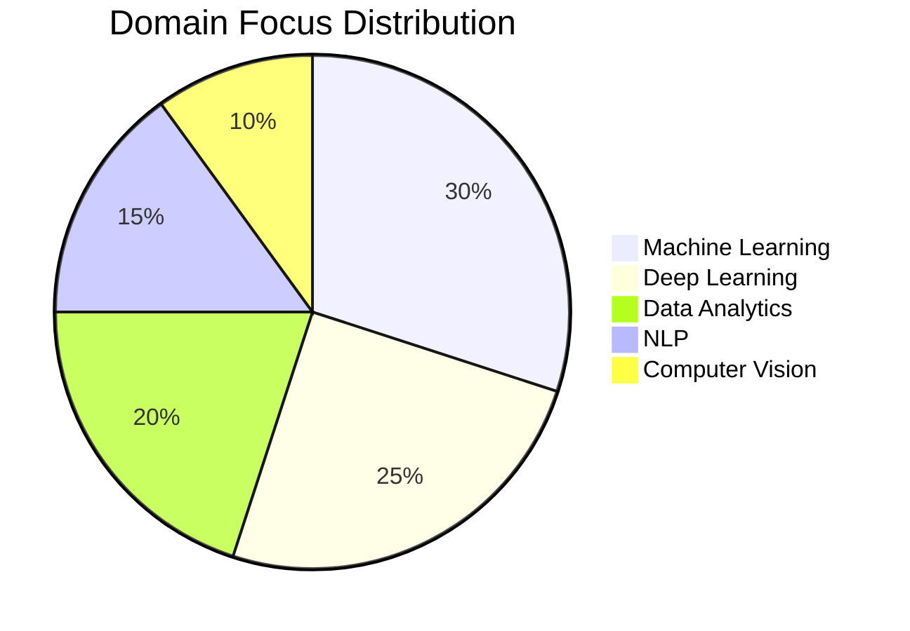

<div align="center">

<!-- ▓▓ GLITCH NAME ▓▓ -->


<!-- ▓▓ TYPING SUBTITLE ▓▓ -->
<a href="https://git.io/typing-svg">
  
</a>

<br/>

<!-- ▓▓ NEON DIVIDER ▓▓ -->


<!-- ▓▓ TECH BADGES ▓▓ -->
<br/>


<br/>


</div>

-----

<div align="center">

### •   A B O U T   M E   •

I am an aspiring **Full Stack Developer** and **AI Engineer** pursuing my B.Tech in CSE (Data Science) at **Woxsen University**. My focus lies at the intersection of robust web architectures and intelligent systems—specializing in **Full Stack Web Architectures**, **AI-Powered Integrations**, and **Scalable Platforms**. I strive to bridge complex technologies with intuitive user experiences that empower communities and drive impact.

</div>

-----

<!-- ═══════════════════════════════════════════════════════════ -->

<!--                   •  IDENTITY CORE  •                     -->

<!-- ═══════════════════════════════════════════════════════════ -->

<div align="center">

### •   I D E N T I T Y   C O R E   •

</div>

```
╔══════════════════════════════════════════════════════════════════════╗
║                         GAYATHRI.CORE  v3.0                          ║
╠══════════════════════════════════════════════════════════════════════╣
║                                                                      ║
║  entity        : Gayathri Pocharam                                   ║
║  role          : Full Stack Developer · AI Engineer                  ║
║  institute     : Woxsen University · CSE-DS '28                      ║
║  speciality    : Full Stack Web · AI Integrations                    ║
║  location      : Hyderabad, India                                    ║
║                                                                      ║
║  domains:                                                            ║
║    ├─ [Web] Full Stack Web Development (React/Flask/SQL)             ║
║    ├─ [AI]  Machine Learning & Integrations                          ║
║    ├─ [NLP] Natural Language Processing                              ║
║    ├─ [CV]  Computer Vision & Image Processing                       ║
║    ├─ [BI]  Data Visualization & Business Intelligence               ║
║    └─ [Sys] Scalable Systems & Optimization                          ║
║                                                                      ║
║  current_state:                                                      ║
║    semester    : 5th Semester  (3rd Year)                            ║
║    focus       : FoodBridge + StrokeGuard AI                         ║
║    mindset     : User Centric · Clean Code · Scalable Systems        ║
║    mission     : Build tech that empowers communities                ║
║                                                                      ║
║  achievements:                                                       ║
║    ├─ StrokeGuard AI Innovation Lead                                 ║
║    ├─ Academic Excellence in Data Science · 2024                     ║
║    ├─ FoodBridge Platform Core Developer                             ║
║    └─ AI Research & Workshop Facilitator                             ║
║                                                                      ║
║  status        : ONLINE · coding solutions                           ║
╚══════════════════════════════════════════════════════════════════════╝
```

-----

<!-- ═══════════════════════════════════════════════════════════ -->

<!--                 •  PATENT ACHIEVEMENT  •                  -->

<!-- ═══════════════════════════════════════════════════════════ -->

<div align="center">

### •   P A T E N T   A C H I E V E M E N T   •


**Title:** *IoT Connectivity Device Design*  
**Design No:** `470097-001`  
**Role:** Co-Inventor  
**Authority:** Intellectual Property India, Government of India  

</div>


-----

<div align="center">

### •   T E C H   S T A C K   D N A   •

```
╔══════════════════════════════════════════════════════════════════════╗
║                          • TECH STACK DNA •                          ║
╠══════════════════════════════════════════════════════════════════════╣
║                                                                      ║
║  LANGUAGES      : Python · JavaScript · SQL · R · C++                ║
║  FRAMEWORKS     : React · Flask · Node.js · Express · TailwindCSS    ║
║  LIBRARIES      : PyTorch · TensorFlow · Scikit-learn · Pandas       ║
║  TOOLS          : Git · GitHub · VSCode · Docker · Linux · CI/CD     ║
║  ANALYTICS      : PostgreSQL · SQLite · PowerBI · Tableau · Excel    ║
║                                                                      ║
║  STATE          : Optimized · Scalable · Clean-Architecture          ║
║                                                                      ║
╚══════════════════════════════════════════════════════════════════════╝
```

</div>

<br/>

<div align="center">

### •   S K I L L   M A T R I X   •

</div>

|Domain          |Technology                 |
|----------------|---------------------------|
|🌐 **Web Dev**   |React · Node.js · Express · Flask · HTML5 · CSS3 · TailwindCSS |
|🐍 **Languages** |Python · JavaScript · SQL · R · C++ |
|🤖 **AI / ML**   |PyTorch · TensorFlow · Scikit-learn · NLP |
|🗄️ **Databases**|SQLite · PostgreSQL |
|🐳 **Tools / Ops**|Git · GitHub · Docker · Linux · CI/CD |

-----

<!-- ═══════════════════════════════════════════════════════════ -->


<!-- ═══════════════════════════════════════════════════════════ -->


-----

<!-- ═══════════════════════════════════════════════════════════ -->

<!--          •  FEATURED PROJECT DEEP DIVES  •                -->

<!-- ═══════════════════════════════════════════════════════════ -->

<div align="center">

### •   F E A T U R E D   P R O J E C T S   —   D E E P   D I V E   •

</div>

<table>
<tr>
<td width="50%" valign="top">

**🧠 StrokeGuard AI — Health Prediction**
*ML-Powered Early Warning System*

```
┌─────────────────────────────────┐
│         DATA PIPELINE           │
│                                 │
│  [ CLINICAL DATA INPUT ]        │
│        ↓                        │
│  [ Pre-processing Lab ]         │
│    Handling Missing Values      │
│        ↓                        │
│  [ Feature Engineering ]        │
│    Correlating Risk Factors     │
│        ↓                        │
│  [ ML Training Engine ]         │
│    Random Forest / XGBoost      │
│        ↓                        │
│  [ Prediction Web App ]         │
│    Flask / Streamlit Interface  │
└─────────────────────────────────┘
```

**Stack:** `Python` `Scikit-learn` `XGBoost` `Flask` `Pandas`
**Status:** <font color="#00C86F">LIVE</font>

</td>
<td width="50%" valign="top">

**🌉 FoodBridge — Surplus Food Redistribution**
*Full-Stack Sharing Platform*

```
┌─────────────────────────────────┐
│         PLATFORM FLOW           │
│                                 │
│  [ SURPLUS DONORS ]             │
│        ↓                        │
│  [ Quality Verification ]       │
│    Safe Temp & Expiry Scan      │
│        ↓                        │
│  [ FoodBridge Core ]            │
│    Matching & Routing Engine    │
│        ↓                        │
│  [ VOLUNTEERS / NGOS ]          │
│    Claiming Delivery Tasks      │
│        ↓                        │
│  [ IMPACT METRICS ]             │
│    CO₂ Savings & Meals Saved    │
└─────────────────────────────────┘
```

**Stack:** `React` `Flask` `SQLite` `TailwindCSS` `Node.js`
**Status:** <font color="#00C86F">ACTIVE</font>

</td>
</tr>
<tr>
<td colspan="2" align="center" valign="top">

<div align="left" style="width: 350px; text-align: left; display: inline-block;">

**📊 E-commerce BI Dashboard**
*Interactive Business Intelligence Matrix*

```
┌─────────────────────────────────┐
│        ANALYTICS FLOW           │
│                                 │
│  [ RAW SQL DATABASE ]           │
│        ↓                        │
│  [ ETL Processing ]             │
│    Cleaning & Normalizing       │
│        ↓                        │
│  [ PowerBI Core Map ]           │
│    DAX Queries + Visuals        │
│        ↓                        │
│  [ Insight Delivery ]           │
│    Sales + Growth Trends        │
│        ↓                        │
│  [ Periodic Reporting ]         │
│    Automated PDF generation     │
└─────────────────────────────────┘
```

**Stack:** `PowerBI` `SQL` `Python` `Pandas` `Excel`
**Status:** <font color="#00C86F">ACTIVE</font>

</div>

</td>
</tr>
</table>

-----

<!-- ═══════════════════════════════════════════════════════════ -->


<!-- ═══════════════════════════════════════════════════════════ -->


<!-- ═══════════════════════════════════════════════════════════ -->


<!-- ═══════════════════════════════════════════════════════════ -->

<!--                 •  GITHUB METRICS  •                      -->

<!-- ═══════════════════════════════════════════════════════════ -->

<div align="center">

### •   G I T H U B   M E T R I C S   •


&nbsp;&nbsp;


<br/><br/>


</div>

-----

<!-- ═══════════════════════════════════════════════════════════ -->

<!--                 •  ACTIVITY GRAPH  •                      -->

<!-- ═══════════════════════════════════════════════════════════ -->

<div align="center">

### •   C O M M I T   T I M E L I N E   •


</div>

-----

<!-- ═══════════════════════════════════════════════════════════ -->

<!--                  •  TROPHIES  •                           -->

<!-- ═══════════════════════════════════════════════════════════ -->

<div align="center">

### •   A C H I E V E M E N T   G R I D   •


<br/>

|🏆 Award                             |📅 Year |🏛️ Institution              |
|------------------------------------|:-----:|---------------------------|
|StrokeGuard AI Innovation Lead      |2024   |Woxsen School of Technology|
|Academic Excellence in Data Science  |2024   |Woxsen University          |
|15+ Data Science Public Projects    |2024–25|GitHub                     |
|AI Research & Workshop Facilitator  |2024–25|Various · Peer-led         |

</div>

-----

<!-- ═══════════════════════════════════════════════════════════ -->

<!--              •  DOMAIN EXPERTISE PIE  •                   -->

<!-- ═══════════════════════════════════════════════════════════ -->

<div align="center">

### •   D O M A I N   F O C U S   D I S T R I B U T I O N   •

</div>



-----

<!-- ═══════════════════════════════════════════════════════════ -->

<!--                  •  AI PERSONALITY  •                     -->

<!-- ═══════════════════════════════════════════════════════════ -->

<div align="center">

### •   G A Y A T H R I . A I   —   P E R S O N A L I T Y   M O D U L E   •

</div>

```python
class GayathriPocharam:
    """
    ╔══════════════════════════════════════════════════════════╗
    ║        GAYATHRI POCHARAM · FULL STACK DEVELOPER OS       ║
    ║        Version: 3.1-stable  |  Build: 2028-optimized     ║
    ╚══════════════════════════════════════════════════════════╝
    """

    OPERATING_SINCE = 2024
    VERSION         = "3.1-stable"
    UNIVERSITY      = "Woxsen University — CSE-DS '28"
    LOCATION        = "Hyderabad, India 🇮🇳"

    def __init__(self):
        self.role         = "Full Stack Developer · AI Engineer"
        self.domains      = ["Full Stack Web", "AI Integrations", "NLP", "Computer Vision", "BI"]
        self.stack        = ["React", "Flask", "Node.js", "Python", "SQL", "TailwindCSS"]
        self.specialty    = "Full Stack Web & AI-Powered Applications"
        self.mindset      = "User Centric · Clean Code · Scalable Systems"
        self.fuel         = ["Clean Code 💻", "API Endpoints", "React Hooks", "Espresso ☕"]
        self.achievements = [
            "StrokeGuard Innovation Lead",
            "Academic Excellence 2024",
            "FoodBridge Core Developer",
            "AI Workshop Lead"
        ]
        self.status       = "🟢 ONLINE — coding solutions"

    def analyze(self)  -> str: return "What do the users need and how can the systems scale?"
    def solve(self)    -> str: return "Clean code. Robust APIs. Seamless user experience."
    def learn(self)    -> str: return "Every technology stack is a tool to solve real-world problems."
    def goal(self)     -> str: return "Build tech that bridges gaps & empowers communities. 🌍"
    def current(self)  -> str: return "Woxsen University CSE → Data Science Track"
    def next(self)     -> str: return "Full Stack Internship → AI Solutions Dev → Tech Entrepreneur"

    def system_check(self) -> dict:
        return {
            "web_engine"     : "🟢 ONLINE — React + Flask API active",
            "ai_hub"         : "🟢 ONLINE — PyTorch + Transformers",
            "viz_lab"        : "🟢 ONLINE — PowerBI + Plotly active",
            "db_ops"         : "🟢 ONLINE — PostgreSQL + SQLite connected",
            "deploy_ops"     : "🟢 ONLINE — Dockerized + CI/CD active",
        }


gayathri = GayathriPocharam()
print(gayathri.goal())          # → "Build tech that bridges gaps & empowers communities. 🌍"
print(gayathri.system_check())  # → All systems nominal
```

-----

<!-- ═══════════════════════════════════════════════════════════ -->


<!-- ═══════════════════════════════════════════════════════════ -->


<!-- ═══════════════════════════════════════════════════════════ -->


<!-- ═══════════════════════════════════════════════════════════ -->

<!--               •  CONNECT / CONTACT  •                     -->

<!-- ═══════════════════════════════════════════════════════════ -->

<div align="center">

### •   E S T A B L I S H   C O N N E C T I O N   •

<a href="https://github.com/GayathriPocharam">
  
</a>
&nbsp;
<a href="https://github.com/GayathriPocharam">
  
</a>
&nbsp;
<a href="https://www.linkedin.com/in/gayathripocharam">
  
</a>

<br/><br/>

|💼 Open To                 |📋 Details                                                        |
|--------------------------|-----------------------------------------------------------------|
|🎯 **Internships**         |Full Stack Web Development · Software Engineering · AI Engineering|
|🤝 **Collaborations**      |Open source web apps · SaaS products · AI integrations           |
|🔬 **Research Projects**   |Human-AI Interfaces · Cloud Architectures · NLP Integrations     |
|💡 **Idea Exchange**       |System design · API architecture · Web optimization              |
|🌍 **Remote Opportunities**|Open to global remote collaborations                             |

<br/>


> *“Building software that bridges gaps and empowers lives through technology.”*

</div>

-----

<!-- ════════════ FOOTER WAVE ════════════ -->

<div align="center">


<br/>

<sub>• Crafted with intent · Powered by curiosity · Secured by design · Deployed with precision •</sub>

</div>
